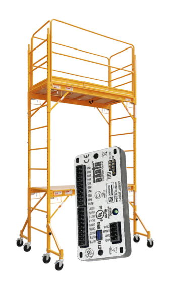

# STG-8nn-Scaffold

[](https://travis-ci.org/adolfogc/stg-8nn-scaffold)
[](https://ci.appveyor.com/project/adolfogc/stg-8nn-scaffold)
[](https://sonarcloud.io/dashboard?id=adolfogc_stg-8nn-scaffold)
[](https://sonarcloud.io/dashboard?id=adolfogc_stg-8nn-scaffold)
[](https://sonarcloud.io/dashboard?id=adolfogc_stg-8nn-scaffold)



A base project for programming the [BARTH® STG-8nn mini-PLCs](https://barth-elektronik.com/en/mini-plc.html).
It is a work-in-progress.

## Motivation
This base project aims to serve as a starting point for those programming in C the BARTH® STG-8nn mini-PLCs, using macOS or Linux as their development platform. Potential users acquainted with Quantum Leaps LLC's QP™ should be able to fork and modify it as needed.

## Design Goals
- Use a modern embedded real-time framework, i.e., Quantum Leaps LLC's QP™/C.
- Use Linux or macOS as the development platform.
- *[future work]* Use a CAN bus bootloader for on-the-field firmware updates.


## Main Software Components
- [QP™/C](https://www.state-machine.com) using the QK kernel.
- [ST's STM32Cube™](https://www.st.com/content/st_com/en/products/embedded-software/mcus-embedded-software/stm32-embedded-software/stm32cube-mcu-packages/stm32cubef0.html), specifically, STM32F0's LL drivers and HAL.

You should be acquainted with the QP™ framework and its concepts in order to use this base project effectively.

## Memory map
| Start address | Description| Size |
| -------------: |:-------------:|:--:|
| 0x08000000 | Vector  | -|

## Building instructions

### Hardware
- BARTH® STG-8nn (mini-PLC)
- ST-Link v2 (In-Circuit Programmer)
- [MikroElektronika IrDA-To-PC Board (MIKROE-441)](https://www.mikroe.com/irda-to-pc-board)

### Getting the code

```bash
https://github.com/adolfogc/stg-8nn-scaffold.git
cd stg-8nn-scaffold
git submodule init
git submodule update
```

### Getting the toolchain and the flashing utility
#### macOS

1. Installing ARM Embedded (GCC-based)

```bash
brew tap osx-cross/arm
brew install arm-gcc-bin stlink open-ocd cmake ninja
```

2. Installing a Clang-based toolchain

```bash
brew tap eblot/armeabi
brew install armv6m-cortex-m0plus
```

#### Linux
Refer to `ci/Dockerfile`.

For the test build, in Ubuntu Linux, install GCC multilib:

```bash
sudo dpkg --add-architecture i386
sudo apt update
sudo apt-get install libc6-dev:i386 gcc-multilib
```

### Compiling the project

1. Using GCC

```bash
mkdir build && cd build
cmake -DCMAKE_TOOLCHAIN_FILE=arm-gcc-toolchain.cmake -DCMAKE_EXPORT_COMPILE_COMMANDS=ON -GNinja ..
cmake --build .
```

2. Using Clang

```bash
mkdir build && cd build
cmake -DCMAKE_TOOLCHAIN_FILE=arm-clang-toolchain-macos.cmake -DCMAKE_EXPORT_COMPILE_COMMANDS=ON -GNinja ..
cmake --build .
```

3. Building the test version
```bash
mkdir build_tester && cd build_tester
cmake -DCMAKE_EXPORT_COMPILE_COMMANDS=ON -GNinja ..
cmake --build .
```

4. Compilation database

The above commands use the `-DCMAKE_EXPORT_COMPILE_COMMANDS=ON` flag so that CMake generates a compilation database. You can use it to check how the source files will get compiled by inspecting the generated file `compile_commands.json`. Also, other tools like Cppcheck and Clang-Tidy use this file.

### Flashing the firmware
```bash
# Flash it using openocd:
openocd \
  -f ../openocd/stm32f0x-stlinkv2.cfg \
  -f ../openocd/stm32f0x-utils.cfg \
  -c "custom_flash firmware.bin" \
  -c shutdown

# Flash it using st-flash (currently not working for me):
st-flash write firmware.bin 0x0800000
```

Note: You can use the [STM32 ST-LINK utility](https://www.st.com/en/development-tools/stsw-link004.html) to update the ST-Link's firmware, but it only runs on Windows.

## Other

### Code format
The file `.clang-format` contains the options used to format this project's codebase using Clang-Tidy.

### Checking compliance with some MISRA C:2012 rules using Cppcheck v1.85+
1. Generate your "rule texts file" using [this Python script](https://github.com/ChisholmKyle/SublimeLinter-contrib-cppcheck-misra/blob/master/scripts/cppcheck-misra-parsetexts.py) and your PDF copy of *"MISRA C:2012 - Guidelines for the use of the C language in critical systems"* and place it in: `ci/scripts/misra-c-2012-rule-texts.txt`.

2. Use the provided script: `ci/scripts/test-cppcheck.sh`.

**Note 0:** No compliance with any MISRA guidelines is claimed here, *"MISRA C:2012 - Guidelines for the use of the C language in critical systems"* is only used as a reference for best practices to follow when developing embedded code using ISO C99.

**Note 1:** [SonarCloud](https://www.sonarsource.com/products/codeanalyzers/sonarcfamilyforcpp.html) is also used in the CI builds to check for compliance with [MISRA C rules](https://rules.sonarsource.com/c/tag/misra).

**Note 2:** The QP™/C framework is MISRA C:2004 compliant to the extend described in [that project's compliance matrix](http://www.state-machine.com/doc/AN_QP-C_MISRA.pdf).

**Note 3:** STM32CubeF0's HAL and LL are MISRA C:2004 compliant, with some exceptions, as stated in [STM32CubeF0's webpage](https://www.st.com/content/st_com/en/products/embedded-software/mcus-embedded-software/stm32-embedded-software/stm32cube-mcu-packages/stm32cubef0.html).

## License


For more information see [COPYING](COPYING).

## References
A compilation of some useful references that were consulted when creating this project is available in the [doc/REFERENCES.md](doc/REFERENCES.md) file.
